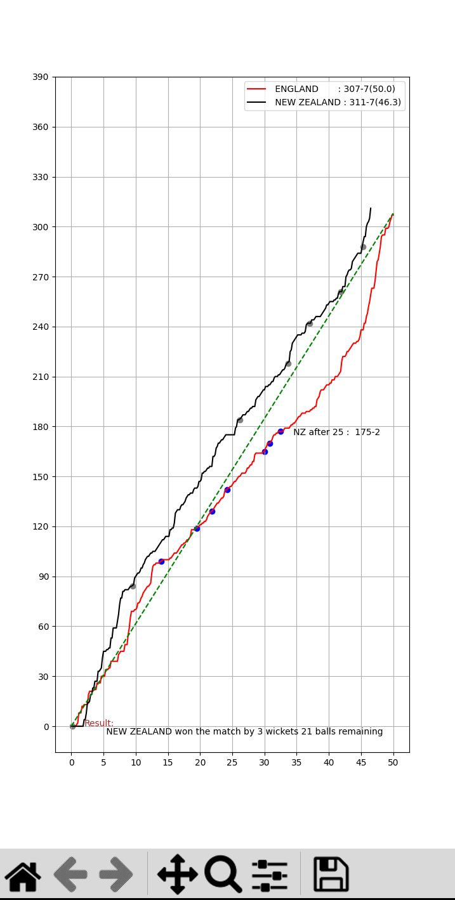

## One day internationals 
NEWZEALAND vs ENGLAND 

<h2> Final </h2>

<h2>The Final </h2>

<h2>📊 Match Output</h2>
< img src = "new-zealand-cricket-logo-png_seeklogo-370601.png">

# Teams
England vs New Zealand 

# overs
50 overs
300 balls

# Some realastics
real powerplay like scoing
real consolidation at middle over
explotion at death overs

# libraries and modules used
matplotlibs 
random

#### Phyton 

